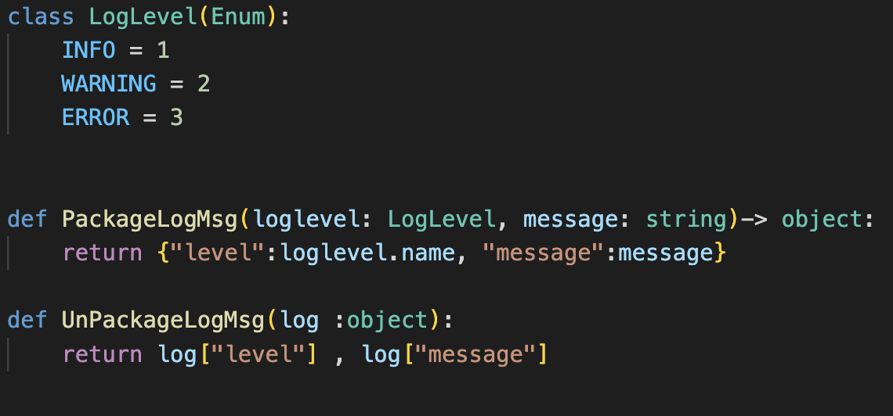

# Hello FL

Easiest way for ML people to learn FL framework. Because it is the simply integration of Ailabs FL framework and the well know Mnist.

## Getting started

Hello FL consist of three mainly parts: `operator` and `fl_edge.py` and `fl_train.py`.
One who wants to fit their 3rd party model into Ailabs framework only need to replace `fl_train.py` with their training script. But should implement some machanism in their own `fl_train.py`.

## Role introduction

* **Operator** : is the one communicate with our edge and the centrol aggregator.
While it works, it will follow the `lifecycle of FL` to call `the four GRPC API` within fl_edge.py.
The `lifecycle of FL` and `the four GRPC API` will be introduced later.


* **fl_edge.py** : is the example of grpc handler for Ailabs FL framework. It handles all the grpc calls while doing FL training. This script is provided by Ailabs if 3rd party model training code is python base. We provide this script to help handling the FL GRPC call.

* **fl_train.py** : is now mainly consist of `Mnist` training code. User with 3rd party training code will replace fl_train.py with their own training code(should also be renamed fl_train.py). And implement the machism need to be implement in current `Mnist`  of fl_train.py example to fit Ailabs FL framework. We will introduce this later.


## The four GRPC API

In the last section, we have introduced the 3 parts of Ailabs FL framework : `Operator`, `fl_edge.py` and `fl_train.py`. Grpc implementation have been done in `Operator` and `fl_edge.py` by Ailabs. So one who wants to integrate their model with Ailabs FL framwork don't need to implement `The four GRPC API` by theirself but should know how it works. Then they will know when to implement machanism should be implemented in `fl_train.py`.

* **TrainInit** : When a FL get started, `Operator` will call the TrainInit（GRPC call) in `fl_edge.py`, which directly means make the training initialized. Users need to initialize their training after this call have been trigger. `fl_edge.py` helps to handle this event, and will call the `init` in `fl_train.py` （the script which will be replace with 3rd's training script if user want their 3rd party training be in FL framwork). So user need to implement `init` in their own `fl_train.py` like example `Mnist` and do initiation in this `init` function. After user have done the initialization in `init` function, user should do trainInitDoneEvent.set() to inform outside that  `fl_edge.py` initialization have done and `fl_edge.py` will help to reply `Operator` this and we will go to next section : LocalTrain.

* **LocalTrain** : After user send trainInitDoneEvent.set(), `Operator` will later call LocalTrain（GRPC call)  in `fl_edge.py`. LocalTrain means to trigger one epoch of training. `fl_edge.py` have help to handle this GPPC and will do `trainStartedEvent.set()` event to `fl_train.py`, and user need to handle this event in `fl_train.py` to lauch a new epoch of training.And after the new epoch of training have done, do `trainFinishedEvent.set()` to inform `fl_edge.py` that this new epoch of training have done.One will do `trainStartedEvent.wait()` in the begining of their training loop and reply with  `trainStartedEvent.clear()`.


* **TrainInterrupt** : This GPPC has not be implemented currently.

* **TrainFinish** : This GRPC will be call after FL training has done. And `fl_edge.py` has help to close the training process.


## Lifecycle of Ailabs FL framework

```plaintext
  TrainInit: In the begining of Ailabs FL training, we will enter a phase called TrainInit.
  This is also the GRPC call name from Operator. We will do initialization at this phase
  like preprocessing and load pretrained model weight. Also any other things needed to be
  done before training can be done at this phase.

  In this phase, our training communicate outside with 1 event : trainInitDoneEvent.
```
<div align="center"></img></div>

```plaintext
  LocalTrain: In the second phase of Ailabs FL training, we enter a phase called LocalTrain.
  This is also the GRPC call name from Operator. This phase will loop 250-1000 times or
  even more. Every LocalTrain phase means an epoch of FL training. How many LocalTrain
  phases we run throug depends on how many epochs(rounds) a FL project set.

  In this phase, our training communicate outside with python event system, there are 2 events in this phase: trainStartedEvent and trainFinishedEvent.
```

<div align="center"></img></div>

## FL Logging system in Ailabs FL framework

<div align="left"></img></div>


Totally we have 3 types of logging: `INFO`,`WARNING` and `ERROR`.
User should pack their message with provided `PackageLogMsg` and put it to the provided queue. Like

```python
logQueue.put(PackageLogMsg(LogLevel.INFO,'Training :trained finished. Start saving model weight'))
```

## The most important things while replace fl_train.py ?

* Must to be done in fl_train.py.
  * Do `trainInitDoneEvent.set()` after initialization has done. To inform that your training initialization has done （before entering training loop）
  * Do `trainStartedEvent.wait()` and `trainStartedEvent.clear()` in the begining of training loop. To blocking the new epoch of training until it recevie trainStartedEvent event.
  * Do `trainFinishedEvent.set()` in the end of training loop to inforn that your one epoch of training has done.

* Good to have
  * using `FL Logging system` to log some customized message whihe in FL triaing will help to realize more when bugs or training problem has occured.


## 3rd that not using Python base, how to do ?

* First, that's see another version msc of this situation. We will not have fl_edge.py. Instead, all GRPC function calls have been handled by fl_edge.py will now handled by 3rd it self.

<div align="left"></img></div>

* Must to be know to replace fl_edge.py
    * Should at least have a thread （process）[called GRPC handler] handles 3 GRPC funcaiton calls.
    * GRPC handler should be independent, not be in same thread/process of training process.
    * GRPC handler can lauch training thread/process after receiving TrainInit GRPC call.
    * Training thread/process will do N epochs training.
    * Training thread/process will wait（blocking）in the begining of every epoch, wait until GRPC handler receiving LocalTrain GRPC call, and start this epoch of training then finish.
    * At the end of every epoch, Training thread/process will call LocallTrainFinish via GRPC handler.
    * GRPC handler received TrainFinsh GRPC call will end all threads/processes.
    * GRPC handler should also implement logs interface and let Training thread/process send logs.