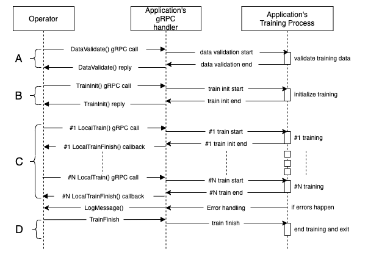

## The Ailabs FL Framework

*Read this in other languages: [English](README.md), [正體中文](README.zh-tw.md).*

* This is how Ailabs FL Framework works.

<div align="left"></img></div>

## The components of Ailabs FL Framework

Ailabs FL Framework consists of 3 components : `Operator`, `gRPC handler` and `Training Process` with
five gRPC interfaces. `Operator` is embedded in Ailabs FL framework. And `gRPC handler` & `Training Process` will must be implemented by yourself.


The `Operator` will send RPC to `gRPC handler` through the lifecycle of a FL training plan. When the `gRPC handler` receives a gRPC from the `Operator`, the `gRPC handler` will do some actions corresponding to the gRPC. The `gRPC handler` would be a single thread/process in order to immediately accept gRPCs (non-blocking) and `Training Process` is another thread/process to do time comsuming operations.


## Lifecycle of Ailabs FL framework and the five gRPC interfaces

We will introduce all five gRPC interfaces through the lifecycle of a FL training plan.

* **DataValidate** (The phase A in the diagram)

  This is the first phase of FL's lifecycle. In this phase, the DataValidate gRPC handler will be
  called, and you will need to validate whether your data is validated or not. If data is valid, reply OK; otherwise, you will need to report errors by Logging interface.


* **TrainInit** (The phase B in the diagram)

  After the DataValidate phase, `Operator` will send the `TrainInit` rpc to `gRPC handler`. You can do any kind of initialization in this phase, such as data preprocessing, loading pretrained model weight, and other things you need before the FL training begin.

* **LocalTrain** (The phase C in the diagram)

  After the TrainInit phase, `Operator` will send the `LocalTrain` rpc to `gRPC handler`. In this phase, the LocalTrain handler will be called
  multiple times, depending on the setting of the FL training plan. Every LocalTrain call means the begining of an epoch of FL training, and your `Training Process` will generate a local model weight and some validating metrics. Validating metrics should be sent back to `gRPC handler` as well as the `Operator`(throgh `LocalTrainFinish` client).

* **TrainFinish** (The phase D in the diagram)

  After all rounds of training have done, the `Opertor` will send `TrainFinish` rpc to `gRPC handler` to ask the `gRPC handler` to shutdown the `Training Process` and the `gRPC handler`.

* **TrainInterrupt**

  When `Operator` send this to `gRPC handler`, you should shutdown the `Training Process` and `gRPC handler`.

## gRPC client interface implementation


* **LocalTrainFinish**

  ```proto

    service EdgeOperator {
      rpc LocalTrainFinish (LocalTrainResult) returns (Empty) {}
    }

    message LocalTrainResult {
      enum Error {
        SUCCESS = 0;
        FAIL = 1;
      }
      Error error = 13;
      int32 datasetSize = 14;
      map<string, string> metadata = 15; // FUTURE:
      map<string, double> metrics = 18;
    }

  ```
  After `gRPC handler` receive `LocalTrain` rpc and you have done one round of local training, make a `LocalTrainFinish` callback to `Operator`. You will need to make a gRPC client follow the definitiaon above.


* **LogMessage** (logging interface in Ailabs FL framework)

  ```proto
    service EdgeOperator {
      rpc LogMessage (Log) returns (Empty) {}
    }

    message Log {
      string level = 1;
      string message = 2;
    }
  ```
  You will need to implement this log interface and send log to `Operator` with certain level below.

* There are 3 types of logging level: `INFO`,`WARNING` and `ERROR`.
  * `INFO`: No retriction. Choose this level if you just want to log.

  * `WARNING`: Something wrong happend, but no fatal error curved. Send log with this log level.

  * `ERROR`: Some fatal errors curved. Send log with this log level. And all systems will close.

##  Things needs to be done to implement Ailabs FL Framework
  1. Implement a gRPC server with the five gRPC ineterfaces(handles DataValidate,TrainInit,LocalTrain,TrainFinish,TrainInterrupt)
  2. Implement a gRPC client with LocalTrainFinish.
  3. Implement a gRPC client with LogMessage.

--------------------------------------------------------------------------------------------------------------------

# Hello-FL

Hello-FL 主要由python撰寫，讓開發者學習Ailabs's FL framework，Hello-FL使用MNIST作示範。

# 如何進行

首先，我們會講解Hello-FL當中每個組成部分是對應到Ailabs's FL framework的哪個部分，以讓您知道該怎麼對照Ailabs's FL framework來實作出您自己能符合Ailabs's FL framework的訓練專案。

接下來，我們會實際帶您透過FL validator 來執行Hello-FL一輪的training，您就會了解整套系統是如何運作的。
## Getting started

在Hello-FL之中，我們實作了一個docker image，裡面以python實作了2個元件(`gRPC handlder` & `Training Process`)以及(5+2)個gRPC interfaces.


在`Hello-FL`之中，我們將框架裡的`gRPC handlder`實作為`fl_edge.py`而框架裡的`Training Process` 實作為 `fl_train.py`。`fl_edge.py`是一個non-blocking的thread/process去接受或發送gRPC，而`fl_train.py`則是另一個thread/process專門處理data的preprocess或者是training等較耗時的工作。

### 訓練流程

<div align="center"></img></div>

#### 階段A
`Operator` 會發送一個gRPC請求 `DataValidate` 到 `fl_edge.py`，`fl_edge.py`收到後會進行blocking的資料驗證(data validation)流程，我們目前給予的處理時限為1個小時，`fl_edge.py`處理完資料驗證後，不論資料是valid或者invalid，`fl_edge.py`都會回傳OK(代表驗證已完成)給`Operator`。 若驗證結果valid，將不再有一步的動作，然而，若是資料有誤，`fl_edge.py`會將錯誤訊息透過logging interface 回傳`Operator`。


#### 階段B
`Operator` 在收到驗證完成的回報後，會發送gRPC請求`TrainInit`到`fl_edge.py`，`fl_edge.py`收到後會進行blocking的訓練初始化流程(training initialization)流程，我們目前給予的處理時限為1個小時，這時候我們執行訓練前的
   1.以獨立的process啟動`fl_train.py`
   2.在 `fl_train.py` 中 load pretrained model
   3.(其他初始化事項也可在這裡處理)
`fl_train.py`被啟動並處理完初始化事項後，會進入一個training 的for loop中，並使用python event控制(註A)，等待更近一步指令的狀態。`fl_edge.py`處理完訓練的初始化後，將會回傳OK(代表初始化已完成)`Operator`。若是初始化過程有誤，我們會將錯誤訊息透過 logging interface 來傳給`Operator`。（line 121 in fl_train.py）


<div align="center"></img></div>

#### 階段C
`Operator` 在收到訓練初始化完成的回報後，會發送一個gRPC請求`LocalTrain`到`fl_edge.py`，`fl_edge.py`收到後會使用python event(註B)，通知`fl_train.py`開始訓練。 此時`fl_train.py`會開始進行local training 並在結束後產出a local model weight，在Hello-FL中為weight.ckpt，以及validation metrics，validation metrics將透過`LocalTrainFinish` gRPC請求傳送給`Operator`，model weight會透過由`Operator`和`Appication`mount同一個資料夾的方式，讓而`Operator`能存取產出的model weight。 `Operator`收到`LocalTrainFinish`後，會將local model weight 以及 validating metrics進行處理， 處理完後會再次發送`LocalTrain`的請求給`fl_edge.py`，此時`fl_edge.py`會開始新一輪的local training，如此反覆，直到達到指定的訓練輪數（註C)。

#### 階段D
`Operator` 在訓練輪數達到訓練計畫指定的數量後，將會發送 `TrainFinish`到`fl_edge.py`，此時 `fl_edge.py`將會把`fl_train.py` process 關閉，並將自己關閉。


註A: `fl_train.py` process 在完成自己的initialization，會做 `trainInitDoneEvent.set()` 來告知 `fl_edge.py` training process(即`fl_train.py`自己)完成初始化了，並開始進入ML所謂training for loop中的第一個loop作等待 (其等待的event為trainStartedEvent)

註B: `fl_edge.py` 會做 `trainStartedEvent.set()` 來告知 `fl_train.py` process 可以開始做training了，此時`fl_train.py`會做`trainStartedEvent.clear()` 告知 `fl_edge.py` 自己已開始訓練，並在結束的時候做 `trainFinishedEvent.set()` 來告知`fl_edge.py` 已完成訓練，並到training loop 下一輪中等待`fl_edge.py` 對其新一輪訓練的請求。


註C:實際執行的次數取決於訓練計畫中指定的訓練輪數。


## FL Logging interface of Hello-FL

我們使用Python的queue與單獨的process實作 gRPC client interface `LogMessage`

```python
def logEventLoop(logQueue):
    while True:
        obj = logQueue.get()
        channel = grpc.insecure_channel(OPERATOR_URI)
        stub = service_pb2_grpc.EdgeOperatorStub(channel)
        level, message = UnPackageLogMsg(obj)
        logging.info(f"Send log level: {level} message: {message}")
        message = service_pb2.Log(
            level = level,
            message = message
        )
        try:
            response = stub.LogMessage(message)
            logging.info(f"Log sending succeeds, response: {response}")
        except grpc.RpcError as rpc_error:
            logging.error(f"grpc error: {rpc_error}")
        except Exception as err:
            logging.error(f"got error: {err}")
        if level == LogLevel.ERROR:
            global loop
            loop = False
            return
```

以下將格式進行打包，完成logging framework中對log message的定義

```python
class LogLevel(Enum):
    INFO = 1
    WARNING = 2
    ERROR = 3

def PackageLogMsg(loglevel: LogLevel, message: string)-> object:
    return {"level":loglevel.name, "message":message}

def UnPackageLogMsg(log :object):
    return log["level"] , log["message"]
```

在 Hello-FL 之中

There are 3 logging level types: `INFO`,`WARNING` and `ERROR`.
Users should pack their message with the provided `PackageLogMsg` and put it to the provided queue. Like

```python
logQueue.put(PackageLogMsg(LogLevel.INFO,'Training :trained finished. Start saving model weight'))
```

## How to build Hello FL into a valid `Applicaiton` docker image

```bash
docker build --tag hello-fl:1.0 -f dockerfile/Dockerfile.fl.edge .
```