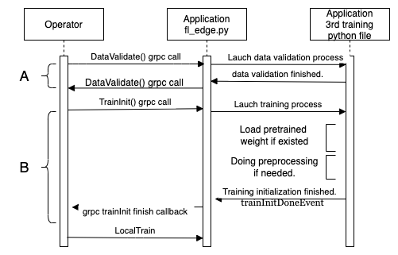

# Hello FL

Easiest way for ML people to learn FL framework. Because it is the simple integration of Ailabs FL framework and the well-known Mnist.

## Getting started

Hello FL consists of three main parts: `operator` and `fl_edge.py` and `fl_train.py`.
One who wants to fit their 3rd party model into Ailabs framework only needs to replace `fl_train.py` with their training script. But should implement some mechanism in their own `fl_train.py`.

## Role introduction

* **Operator** : is the one communicating with our edge and the central aggregator.
While it works, it will follow the `lifecycle of FL` to call `the four GRPC API` within fl_edge.py.
The `lifecycle of FL` and `the four GRPC API` will be introduced later..


* **fl_edge.py** : is the example of grpc handler for Ailabs FL framework. It handles all the grpc calls while doing FL training. This script is provided by Ailabs if 3rd party model training code is python based. We provide this script to help handle the FL GRPC call.

* **fl_train.py** : is now mainly consisting of `Mnist` training code. Users with 3rd party training code will replace fl_train.py with their own training code(should also be renamed fl_train.py). And implement the machism needed to be implemented in current `Mnist`  of fl_train.py example to fit Ailabs FL framework. We will introduce this later.


## The five GRPC API

In the last section, we have introduced the 3 parts of Ailabs FL framework : `Operator`, `fl_edge.py` and `fl_train.py`. Grpc implementations have been done in `Operator` and `fl_edge.py` by Ailabs. So one who wants to integrate their model with Ailabs FL framework don't need to implement `The four GRPC API` by theirself but should know how it works. Then they will know when to implement the mechanism should be implemented in `fl_train.py`.

* **DataValidation** : Before a FL really gets started, we will need to do data's validation. When receiving this grpc call, fl_edge.py will help to launch a process which will call the function in the script file you have provided. Then after the validation process has been done. Return this grpc call with OK. If there is something wrong, one should use our log system to report errors.


* **TrainInit** : After data's validation has been done, FL gets started, `Operator` will call the TrainInit（GRPC call) in `fl_edge.py`, which directly means to make the training initialized. Users need to initialize their training after this call has been triggered. `fl_edge.py` helps to handle this event, and will call the `init` in `fl_train.py` （the script which will be replaced with 3rd's training script if users want their 3rd party training to be in FL framework). So users need to implement `init` in their own `fl_train.py` like example `Mnist` and do initiation in this `init` function. After users have done the initialization in `init` function, users should do trainInitDoneEvent.set() to inform outside that  `fl_edge.py` initialization have done and `fl_edge.py` will help to reply `Operator` this and we will go to next section : LocalTrain.

* **LocalTrain** : After users send trainInitDoneEvent.set(), `Operator` will later call LocalTrain（GRPC call)  in `fl_edge.py`. LocalTrain means to trigger one epoch of training. `fl_edge.py` have help to handle this GPPC and will do `trainStartedEvent.set()` event to `fl_train.py`, and users need to handle this event in `fl_train.py` to launch a new epoch of training.And after the new epoch of training have done, do `trainFinishedEvent.set()` to inform `fl_edge.py` that this new epoch of training have done.One will do `trainStartedEvent.wait()` in the beginning of their training loop and reply with  `trainStartedEvent.clear()`.


* **TrainInterrupt** : This GPPC has not been implemented  currently.

* **TrainFinish** : This GRPC will be called after FL training has finished. And `fl_edge.py` has helped to close the training process.


## Lifecycle of Ailabs FL framework

<div align="center"></img></div>

Here we begin with DataValidation phase,

```plaintext
  DataValidation: This is the first phase of FL's lifecycle, we need to check whether our training
  dataset is valid or not in this phase. In this phase, a validation function will be called, and
  you can do validation in this function. After you have validated your dataset, if it is correct
  return grpc call with OK. If something is wrong, report errors through our log system.
```

After DataValidation phase done,

```plaintext
  TrainInit: In the beginning of Ailabs FL training, we will enter a phase called TrainInit.
  This is also the GRPC call name from Operator. We will do initialization at this phase
  like preprocessing and load pretrained model weight. Also any other things needed to be
  done before training can be done at this phase.

  In this phase, our training communicates outside with 1 event : trainInitDoneEvent.
```

```plaintext
  LocalTrain: In the second phase of Ailabs FL training, we enter a phase called LocalTrain.
  This is also the GRPC call name from Operator. This phase will loop 250-1000 times or
  even more. Every LocalTrain phase means an epoch of FL training. How many LocalTrain
  phases we run through depends on how many epochs(rounds) a FL project set.

  In this phase, our training communicates outside with the python event system, there are 2 events in this phase: trainStartedEvent and trainFinishedEvent.
```

<div align="center"></img></div>

## FL Logging system in Ailabs FL framework

```python
class LogLevel(Enum):
    INFO = 1
    WARNING = 2
    ERROR = 3


def PackageLogMsg(loglevel: LogLevel, message: string)-> object:
    return {"level":loglevel.name, "message":message}

def UnPackageLogMsg(log :object):
    return log["level"] , log["message"]
```

Totally we have 3 types of logging: `INFO`,`WARNING` and `ERROR`.
Users should pack their message with the provided `PackageLogMsg` and put it to the provided queue. Like

```python
logQueue.put(PackageLogMsg(LogLevel.INFO,'Training :trained finished. Start saving model weight'))
```

## The most important things while replacing fl_train.py ?

* Must be done in fl_train.py.

  * Do `trainInitDoneEvent.set()` after initialization has been done. To inform that your training initialization has done （before entering training loop）

  * Do `trainStartedEvent.wait()` and `trainStartedEvent.clear()` in the beginning of the training loop. To block the new epoch of training until it received the trainStartedEvent event.

  * Do `trainFinishedEvent.set()` at the end of the training loop to inform that your one epoch of training has done.

* Good to have
  * Using the `FL Logging system` to log some customized messages while in FL training will help to realize more when bugs or training problems have occurred.


## 3rd that not using Python base, how to do it?

* First, see another msc of this situation. We will not have fl_edge.py. Instead, all GRPC function calls that were handled by fl_edge.py will now be handled by 3rd itself.

<div align="left"></img></div>

* Must to be know to replace fl_edge.py
    * Should at least have a thread （process）[called GRPC handler] handles 3 GRPC function calls.
    * GRPC handlers should be independent, not be in the same thread/process of training process.
    * GRPC handlers can launch a training thread/process after receiving a TrainInit GRPC call.
    * Training thread/process will do N epochs training.
    * Training thread/process will wait（blocking）until the GRPC at the beginning of every epoch, wait until the GRPC handler receives LocalTrain GRPC call, and start this epoch of training then finish.
    * At the end of every epoch, the Training thread/process will call LocallTrainFinish via the GRPC handler.
    * GRPC handlers received TrainFinsh GRPC calls will end all threads/processes.
    * GRPC handlers should also implement a logs interface and let Training thread/process send logs.
